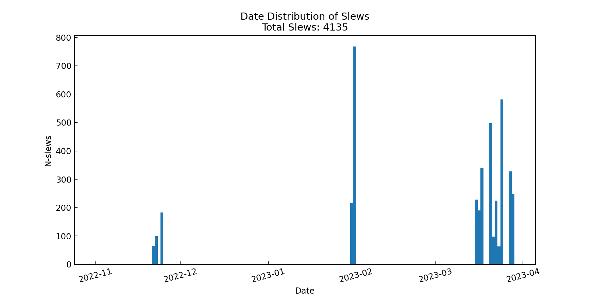
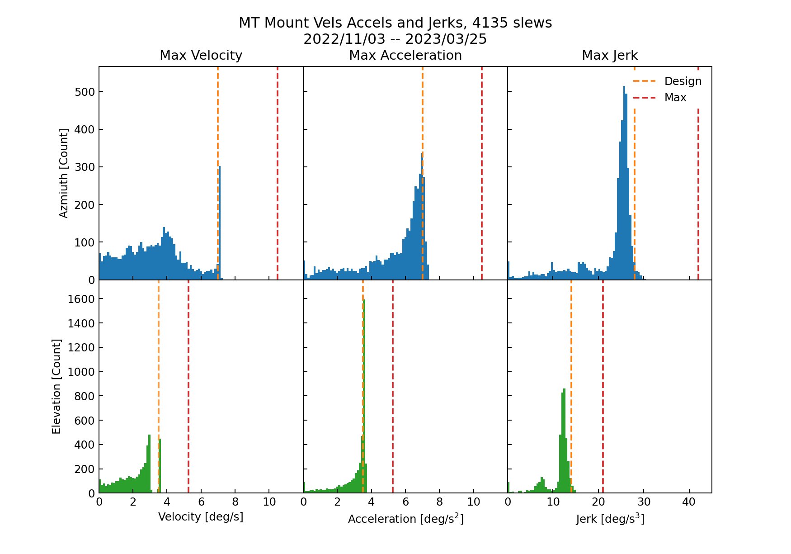
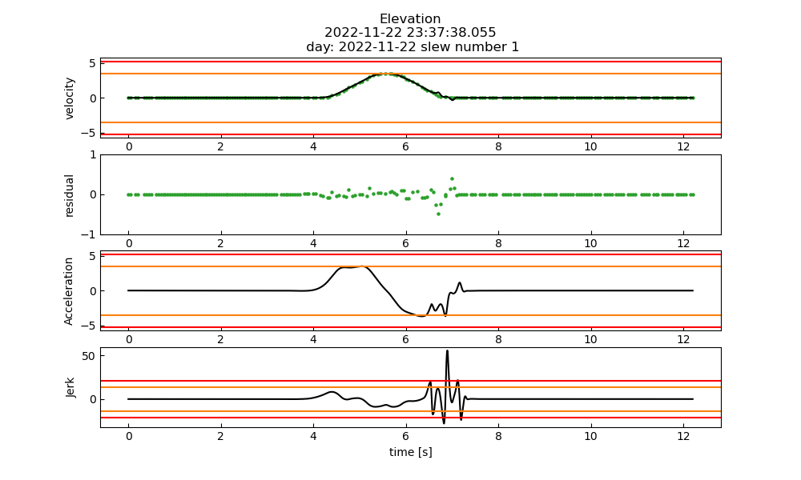

#################
TMA slewing rates
#################

Abstract
========

This technote shows analysis of velocity, acceleration and jerk of the TMA for all identified slews. This builds off the analysis described in `SITCOMTN-067 <https://sitcomtn-067.lsst.io/>`__. All slews are with max specifications, but a small number exceed design specifications.

LTS-103: 2.2.2 Slewing Rates uses the following files in `lsst-sitcom/notebooks_vandv <https://github.com/lsst-sitcom/notebooks_vandv/>`__
in the `notebooks/tel_and_site_subsys_req_ver/tma/ <https://github.com/lsst-sitcom/notebooks_vandv/tree/develop/notebooks/tel_and_site/subsys_req_ver/tma>`__ directory:

- ``LVV-TXXXX_max_slew_rates.ipynb``

- ``create_slew_profiles.py``

Methodology
================
The goal of this study was to analyze the velocities, accelerations and jerks of every slew in Winter 2022/Spring 2023. This was done using the azimuth and elevation velocity data (derived from position encoders) stored in the EFD. To reduce noise and following the method described in `SITCOMTN-067 <https://sitcomtn-067.lsst.io/>`__ The velocity data was smoothed (using a top hat kernel size=100) and fit with a cubic spline, this spline was then differentiated to obtain acceleration. Then the acceleration spline was smoothed and differentiated to obtain Jerk.

We also used a `Savitzky–Golay filter <https://en.wikipedia.org/wiki/Savitzky%E2%80%93Golay_filter>`__ to create slew profiles and found similar results.

This analysis was run on all slews identified in the EFD between the dates of 2022/11/01 and 2023/03/30.

Slew Identification
--------------------
Here we describe the method to identify the TMA slews.

As in SITCOMTN-067, we identified slews based off of the ``lsst.sal.MTMount.command_trackTarget`` and ``lsst.sal.MTMount.logevent_azimuthInPosition`` tables in addition to ``lsst.sal.MTMount.azimuth'(elevation)``. The ``az_track`` timestamps were used to identify slew starts and the ``'inPos'==True`` timestamp used to define the end of a slew. In extending this analysis to all slews, a few mismatches in slews occured, so we tried detecting slews only from the position encoder data, but found that method to be less reliable.

There was some difficulty with both methods in matching up slew start and stops. To do this we iterated over slew starts and identified the closest slew stop (after the slew start), then we checked that the next identified slew start occured after this closest stop.

Results
================

After deriving slew profiles for each identified slew we ran the slew identification script ``create_slew_profiles.py`` on all nights between 31/03/2023 and 01/11/2022. The distribution of identified slews (using method 2, add method 1) is show in Figure 1.

Figure 1.  date distribution of identified slews

Then for each of the identified slews we computed the maximum velocity, acceleration and jerk. Histograms of the maximums are shown in Figure 2. The top row shows histograms for Azmiuth slews and the bottom for eleveation. The orange and red lines in each panel show the design and maximum limits respectively.

Figure 2.  distribution of max velocities, accelerations and jerks for all identified azimuth and elevation slews

From this we flagged 19 slews as exceeding the maximum limits of the telescope. For each of these we created diagnostic plots example shown in Figure 3, and visually inspected the slews. All of the flagged ones had poor fits that when run by hand resulted in slew profiles that were within specifications.

Figure 3.  an example of a selw that was identified as failing the max jerk specification, but as will all flagged slews the failure was an obvious fit failure.

The below table lists the start time of flagged slews (this start time incudes a 4 second buffer, so should be 4 seconds before the slew ``command_trackTarget`` timestamp)

+------------+--------------+
|    Day     |  slew start  |
+============+==============+
| 2022-11-22 | 01:15:06.047 |
+------------+--------------+
| 2022-11-22 | 01:17:32.597 |
+------------+--------------+
| 2022-11-22 | 02:12:41.523 |
+------------+--------------+
| 2022-11-22 | 02:16:36.322 |
+------------+--------------+
| 2022-11-22 | 23:37:01.065 |
+------------+--------------+
| 2022-11-22 | 23:52:13.027 |
+------------+--------------+
| 2022-11-23 | 00:06:12.465 |
+------------+--------------+
| 2022-11-23 | 01:06:44.776 |
+------------+--------------+
| 2022-11-23 | 01:14:20.664 |
+------------+--------------+
| 2022-11-23 | 01:28:16.824 |
+------------+--------------+
| 2022-11-23 | 01:29:32.930 |
+------------+--------------+
| 2022-11-23 | 01:30:10.530 |
+------------+--------------+
| 2022-11-23 | 01:32:42.886 |
+------------+--------------+
| 2022-11-25 | 04:57:48.152 |
+------------+--------------+
| 2022-11-25 | 05:08:37.656 |
+------------+--------------+
| 2022-11-25 | 08:36:23.112 |
+------------+--------------+
| 2022-11-25 | 08:37:39.212 |
+------------+--------------+
| 2022-11-25 | 08:56:41.242 |
+------------+--------------+
| 2022-11-25 | 08:52:52.826 |
+------------+--------------+

Summary
==========================

This technote shows a summary of the TMA performance for velocity, acceleration, and jerk durin soak test on on two nights.  All slews meet the specifications for velocity, acceleration, and jerk.
