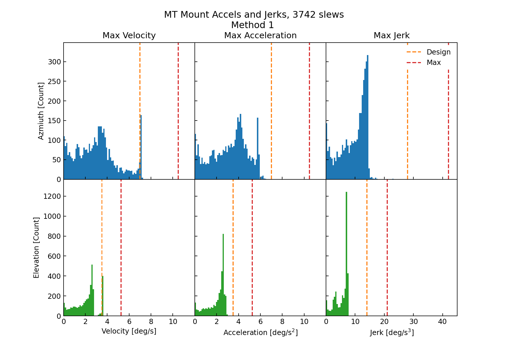
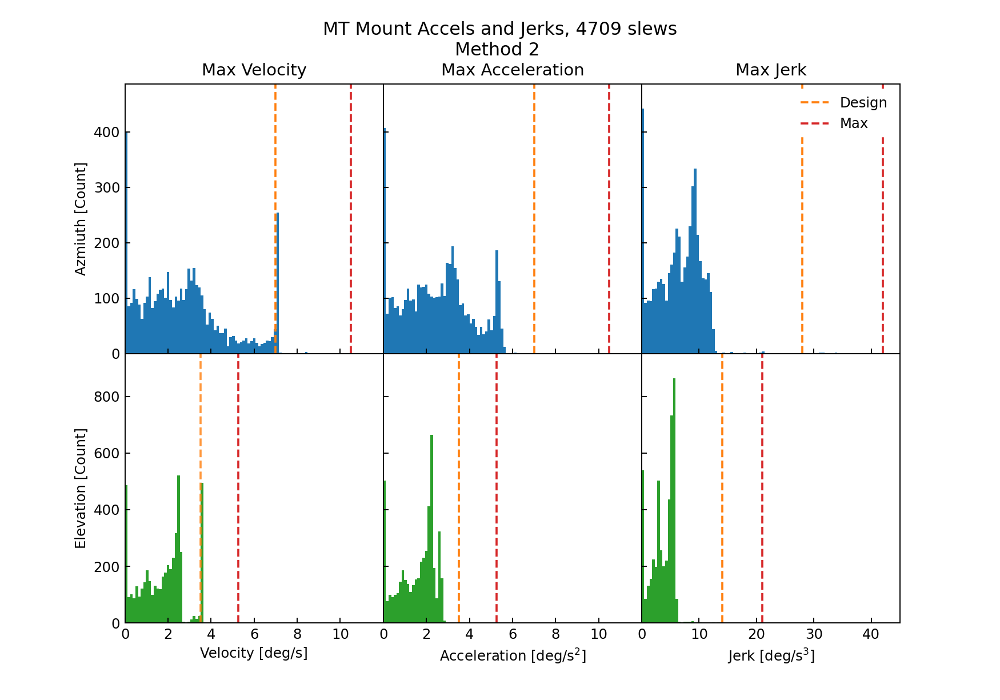

:tocdepth: 1

.. sectnum::

.. Metadata such as the title, authors, and description are set in metadata.yaml

.. TODO: Delete the note below before merging new content to the main branch.

.. note::

   **This technote is a work-in-progress.**

Abstract
========

This technote shows analysis of velocity, acceleration and jerk of the TMA for all identified slews. This builds off the analysis described in `SITCOMTN-067 <https://sitcomtn-067.lsst.io/>`. All slews are with max specifications, but a small number exceed design specifications.

LTS-103: 2.2.2 Slewing Rates

Methodology
================
The goal of this study was analyze the velocities, accelerations and jerks of every slew in Winter 2022/Spring 2023. This was done using the azimuth and elevation velocity data (derived from position encoders) stored in the EFD. To reduce noise and following the method described in `SITCOMTN-067 <https://sitcomtn-067.lsst.io/>` The velocity data was smoothed (using a top hat kernel size=100) and fit with a cubic spline, this spline was then differentiated to obtain acceleration. Then the acceleration spline was smoothed and differentiated to obtain Jerk.

This analysis was run all all slews identified in the EFD between the dates of 2022/11/01 and 2023/03/30.

Slew Identification
------------------
Here we describe two methods to identify the TMA slews.

1. Method 1 was used in SITCOMTN-067, and relies on the 'lsst.sal.MTMount.command_trackTarget' and 'lsst.sal.MTMount.logevent_azimuthInPosition' tables in addition to 'lsst.sal.MTMount.azimuth'(elevation). The az_track timestamps were used to identify slew starts and the 'inPos'==True timestamp used to define the end of a slew. In extending this analysis to all slews, a few mismatches in slews occured, so we tried detecting slews only from the position encoder data.
2. Method 2 uses an edge detection kernel (size=100, prior to evaluation point weight is -1, and after the evaluation point the weight is 1). This kernel when run on the velocity data will peak at the begining of a slew, and hit a minium at the end of a slew. Then a simple peak finder can be run to identify slews.

There was some difficulty with both methods in matching up slew start and stops. To do this we iterated over slew starts and identified the closest slew stop (after the slew start start), then we checked that the next identified slew start occured after this closest stop.

Results
================

After deriving slew profiles for each identified slew we used the following notebook to identify the maximum velocity, acceleration, and jerk experienced
Link here.

We ran the slew identification script `create_slew_profiles.py` on all nights between 31/03/2023 and 01/11/2022. The distribution of identified slews (using method 2, add method 1) is show in Figure 1.

.. image:: ./_static/date_hist.png

Figure 1.  distribution of identified slews

Then for each of the identified slews we computed the maximum velocity, acceleration and jerk. Histograms of the maximums are shown in Figure 2 (Figure 3) for method 1 (method 2). The top row shows histograms for Azmiuth slews and the bottom for eleveation. The orange and red lines in each panel show the design and maximum limits respectively.

Figure 2.  distribution of identified slews

Figure 3.  distribution of identified slews

Show table of nslews that exceed limits.

All of the slews that were initially identified as exceeding max limits, were found to be bad fits upon further inspection.

Method 1
3742 slews     | > design | > max    |
Az Velocity    | 182      | 0        |
Az Acceleration| 0        | 0        |
Az Jerk        | 0        | 0        |
El Velocity    | 405      | 0        |
El Acceleration| 1        | 0        |
El Jerk        | 0        | 0        |

Summary
==========================

This technote shows a summary of the TMA performance for velocity, acceleration, and jerk durin soak test on on two nights.  All slews meet the specifications for velocity, acceleration, and jerk.
